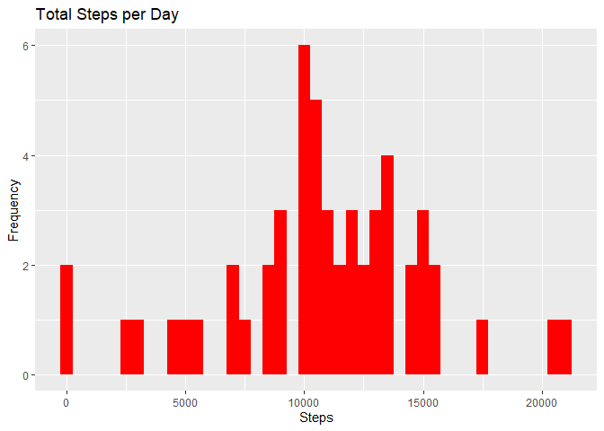
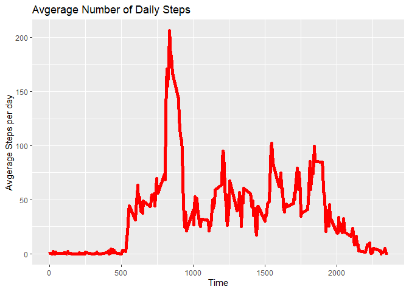
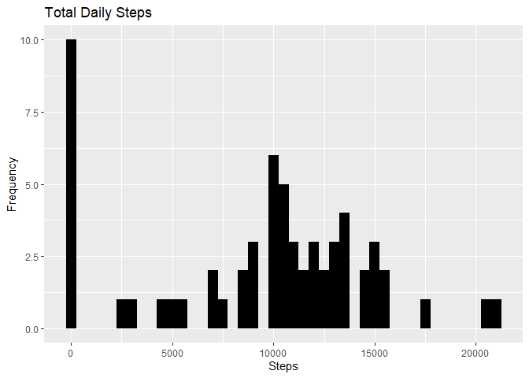
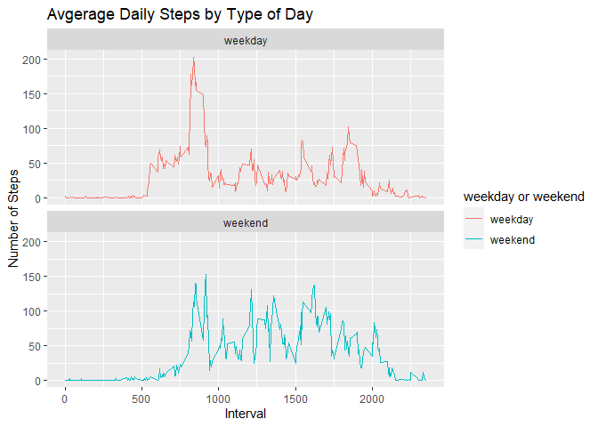

## Loading and preprocessing the data

```r
library("data.table")
library(ggplot2)
```

```
## Warning: package 'ggplot2' was built under R version 4.1.2
```

```r
fileUrl <- "https://d396qusza40orc.cloudfront.net/repdata%2Fdata%2Factivity.zip"
download.file(fileUrl, destfile = paste0(getwd(), '/repdata%2Fdata%2Factivity.zip'))
unzip("repdata%2Fdata%2Factivity.zip",exdir = "data")
activity <- data.table::fread(input = "data/activity.csv")
```

## What is mean total number of steps taken per day?

```r
TSteps <- activity[, c(lapply(.SD, sum, na.rm = FALSE)), .SDcols = c("steps"), by = .(date)] 
ggplot(TSteps, aes(x = steps)) +
     geom_histogram(fill = "red", binwidth = 500) +
    labs(title = "Total Steps per Day", x = "Steps", y = "Frequency")
```

```
## Warning: Removed 8 rows containing non-finite values (stat_bin).
```

<!-- -->

```r
mean(TSteps$steps, na.rm=TRUE)
```

```
## [1] 10766.19
```

```r
median(TSteps$steps, na.rm=TRUE)
```

```
## [1] 10765
```


## What is the average daily activity pattern?

```r
IntervalTable <- activity[, c(lapply(.SD, mean, na.rm = TRUE)), .SDcols = c("steps"), by = .(interval)] 

ggplot(IntervalTable, aes(x = interval , y = steps)) + geom_line(color="red", size=2) + labs(title = "Avgerage Number of Daily Steps", x = "Time", y = "Avgerage Steps per day")
```

<!-- -->

```r
IntervalTable[steps == max(steps), .(max_interval = interval)]
```

```
##    max_interval
## 1:          835
```


## Imputing missing values

```r
nrow(activity[is.na(steps),])
```

```
## [1] 2304
```

```r
activity[is.na(steps), "steps"] <- activity[, c(lapply(.SD, median, na.rm = TRUE)), .SDcols = c("steps")]
data.table::fwrite(x = activity, file = "data/tidyData.csv", quote = FALSE)
TotalSteps <- activity[, c(lapply(.SD, sum)), .SDcols = c("steps"), by = .(date)] 
mean(TotalSteps$steps, na.rm=TRUE)
```

```
## [1] 9354.23
```

```r
median(TotalSteps$steps, na.rm=TRUE)
```

```
## [1] 10395
```

```r
ggplot(TotalSteps, aes(x = steps)) + geom_histogram(fill = "black", binwidth = 500) + labs(title = "Total Daily Steps", x = "Steps", y = "Frequency")
```

<!-- -->


## Are there differences in activity patterns between weekdays and weekends?

```r
activitytable <- data.table::fread(input = "data/activity.csv")
activitytable[, date := as.POSIXct(date, format = "%Y-%m-%d")]
activitytable[, `Day of Week`:= weekdays(x = date)]
activitytable[grepl(pattern = "Monday|Tuesday|Wednesday|Thursday|Friday", x = `Day of Week`), "weekday or weekend"] <- "weekday"
activitytable[grepl(pattern = "Saturday|Sunday", x = `Day of Week`), "weekday or weekend"] <- "weekend"
activitytable[, `weekday or weekend` := as.factor(`weekday or weekend`)]
activitytable[is.na(steps), "steps"] <- activitytable[, c(lapply(.SD, median, na.rm = TRUE)), .SDcols = c("steps")]
Intervals <- activitytable[, c(lapply(.SD, mean, na.rm = TRUE)), .SDcols = c("steps"), by = .(interval, `weekday or weekend`)] 

ggplot(Intervals , aes(x = interval , y = steps, color=`weekday or weekend`)) + geom_line() + labs(title = "Avgerage Daily Steps by Type of Day", x = "Interval", y = "Number of Steps") + facet_wrap(~`weekday or weekend` , ncol = 1, nrow=2)
```

<!-- -->

